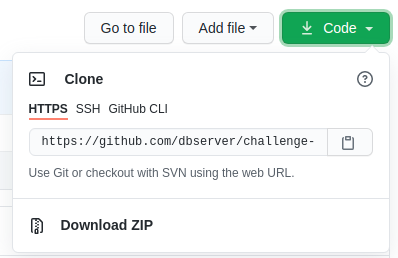

# O desafio da forca

Olá! Se você chegou aqui sem conhecer o StartDB, você pode encontrar mais informações [neste link](https://start.dbserver.com.br/). O desafio desse ano era desenvolver as regras de um jogo da forca. 
Você conhece o jogo da forca?


 

> **Observação:** *Dia das mães* no gif acima é a dica sobre a palavra secreta

É um jogo que antigamente necessitava de duas pessoas, uma para selecionar a palavra secreta e outra para tentar acertar. A pessoa que escolhia a palavra desenhava/registrava tudo no papel, desde o desenho da forca, as letras acertadas e letras erradas. Algo muito próximo do gif acima.

> **Observação:** Somente precisa ser implementado as regras do jogo, não é preciso desenvolver a interface do jogo, o GIF é para demonstração.

# Como executar o projeto?

## Baixando o código do desafio

1. Em <i>Code</i> clique em <i>Download Zip</i>

## Ou clonando o projeto no Github:

1. Clonar projeto (Se não sabe como, acesse [aqui](https://docs.github.com/pt/github/creating-cloning-and-archiving-repositories/cloning-a-repository-from-github/cloning-a-repository))


## Instalando o Node e rodando localmente

1. Instalar o [Node](https://nodejs.org/en/)
2. Instalar dependencias do projeto com o seguinte comando:
```bash
npm install
```
3. Para interagir com o jogo durante o desenvolvimento, você pode executar `desafio.js`, que irá iniciar o jogo no terminal, com o seguinte comando:
```bash
npm start
```

## Regras do jogo

As regras estão descritas [nesse arquivo](docs/Regras.md).

